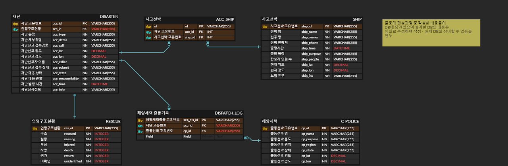

# make_RESTAPI

JAVA Spring Boot를 활용하여 REST API 구축을 공부하기 위한 프로젝트  
해양 재난 상황판 프로젝트의 일부를 정리했습니다.  

# Tech
JAVA  
SpringBoot gradle  
mysql  

## Env
`JDK 11.0.10`  
`Mysql 8.0.26`  
`Spring Boot 2.5.3`  
- Spring Boot dependency  
    - Spring Boot DevTools  
    - Lombok  
    - Spring Web  
    - Spring Data JPA  

# Code
- 사용한 DB  
임의로 구성한 재난정보 더미 데이터  
  

## 주요 코드
- `Entity`: DB와 바로 연결되는 엔티티 클래스  
- `DTO`: Entity의 정보를 받아와서 조작하는 클래스  
- `Repo`: API호출을 위한 함수 정의 클래스
- `ServiceImpl`: Repo에서 정의한 함수를 구현하는 클래스
- `Service`: ServiceImpl에서 정의한 함수의 결과를 리스트 형태로 구성하고, DTO와 Entity간 변환하는 클래스  
- `Controller`: Service를 호출해 쿼리 결과를 API로 표출하고, URL을 매핑하는 클래스

## API 표시  
  

# 공부 내용
[REST API](./studied/RESTApi.md)  
[API](./studied/API.md)  
[JPA](./studied/JPA.md)  
[Builder패턴](./studied/builder.md)  
[Spring Scheduling](./studied/scheduling.md)  
