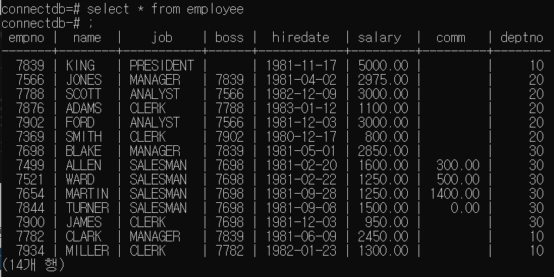

# SpringBoot - DB연동 후 REST API서버 구현  

## 구현 전 준비 
- 사용할 DB  
네이버 부스트코스 spring강의의 DB사용  
department테이블과 employee테이블  

  

  

- 스프링부트 Dependency설정  
  

## 주요 코드
코드는 더 많은 기능을 구현한 Employee관련 엔티티만 표기  

```
# DB연동을 위한 프로퍼티 설정

server.address=localhost
server.port = 8080

spring.datasource.url = jdbc:postgresql://localhost:5432/connectdb
spring.datasource.username = postgres
spring.datasource.password = password
spring.datasource.driver-class-name = org.postgresql.Driver

spring.jpa.database = postgresql
spring.jpa.database-platform = org.hibernate.dialect.PostgreSQLDialect

logging.level.org.hibernate = info

spring.jpa.properties.hibernate.show_sql = true
spring.jpa.properties.hibernate.fromat_sql = true
spring.jpa.properties.hibernate.use_sql_comments = true
```

```java
// empEntity.java
// employee 테이블의 값을 저장할 클래스 생성
package com.example.test.entity;

import lombok.AccessLevel;
import lombok.AllArgsConstructor;
import lombok.Builder;
import lombok.Getter;
import lombok.NoArgsConstructor;
import javax.persistence.*;

@Getter
@Builder
@AllArgsConstructor
@NoArgsConstructor(access = AccessLevel.PROTECTED)
@Entity(name="employee")
public class empEntity {
    // empno를 PK로 하는 테이블의 컬럼을 정의해준다
    @Id
    @Column(nullable = false)
    private int empno;

    @Column(nullable = false, unique = true, length = 30)
    private String name;

    @Column(nullable = false, length = 100)
    private String job;

    @Column(nullable = false)
    private String hiredate;

    @Column(nullable = false)
    private Integer salary;

    @Column(nullable = false)
    private Integer comm;

    @Column(nullable = false)
    private Integer deptno;
}
```  

Entity에 접근해 데이터에 CRUD를 적용하기 위해서 JPA사용.  
JpaRepository를 상속받는 인터페이스를 만들어준다.  
JpaRepository는 기본적으로 CRUD의 기본기능을 하는 메서드를 가진다.  
- `findAll()` : 전체 레코드 불러오기  
- `findOne()` : PK로 레코드 하나 찾기  
- `save()` : 레코드 저장  
- `delete()` : 레코드 삭제  
- `count()` : 레코드 갯수   
다른 기능들은 메서드를 만들어 사용해야 한다.  
[메서드 규칙]  
`findBy~~`: 쿼리를 요청하는 메서드
`countBy~~`: 쿼리 결과 레코드수를 요정 

```java
package com.example.test.repo;

import org.springframework.stereotype.Repository;

import java.util.List;

import com.example.test.entity.empEntity;

import org.springframework.data.jpa.repository.JpaRepository;

@Repository
public interface empRepo extends JpaRepository<empEntity, Long>{
    List<empEntity> findByNameOrJobOrDeptno(String name, String job, Integer deptno);
}
```  

가져온 Employee 엔티티의 조작을 실행해 화면에 띄워줄 Controller를 만들어준다.  
`departEntity`도 포함되어있는 코드이다.  
파라미터를 주소창에 입력하여 여러 컬럼을 인자로 받을 수 있고,  
`required=false`옵션을 통해 반드시 입력받아야 하는 것은 아니도록 조정함.  
```java
package com.example.test.controller;

import com.example.test.repo.MemberRepository;
import com.example.test.repo.empRepo;

import java.util.List;

import com.example.test.entity.departEntity;
import com.example.test.entity.empEntity;

import org.springframework.web.bind.annotation.GetMapping;
import org.springframework.web.bind.annotation.RequestMapping;
import org.springframework.web.bind.annotation.RequestParam;
import org.springframework.web.bind.annotation.RestController;

import lombok.RequiredArgsConstructor;

@RestController
@RequiredArgsConstructor
@RequestMapping("/v1")
public class MemberController {
    private final MemberRepository memberRepository;
    private final empRepo emprepo;

    @GetMapping("/depart")
    public List<departEntity> findAlldepart(){
        return memberRepository.findAll();
    }

    @GetMapping("/employee")
    public List<empEntity> getEmployee(@RequestParam(name = "name", required = false) String name,
                    @RequestParam(name = "job", required = false) String job, 
                    @RequestParam(name = "deptno", required = false) Integer deptno){
        if(name == null && job == null && deptno == null){
            return emprepo.findAll();
        }
        else{
            return emprepo.findByNameOrJobOrDeptno(name, job, deptno);
        }
    }
}
```  
[! 조회 외의 CRUD]()


## 스프링 부트 실행 결과  
  

  

  

## 마무리
Spring과 SpringBoot가 처음이라 뭐부터 해야할지 막막해서 다시보기 편하도록 정리했다.  
프로젝트에 적용하기위해 추가해야할 사항은 최신 레코드 몇줄만 조회하도록 만드는 것이다.  
자료형 최적화도 필요할 듯?  

Builder 패턴에 대한 이해가 더 필요하다.  